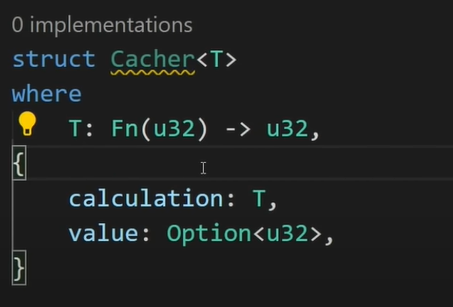

#RUST

integers

- fixed (interi)
- pointer (decimali)

boolean

- true
- false

characters

- char

tuples

- group together values of different types
- max 12 elements

array

- fixed num of values of one type
- is written like [T; N] => T = type, n = length

strings

- String =>has all vector properties
- &str => compiled faster, string expressions
- format!("", variables) => creates a template string

Memory management
references and boxes creates smart pointers
references => borrow values
boxes => store the value like string, you use this when we need to know the size of an element

Vectors

- collect items up to be processed
- items in a particular order
- create a stack
- resizable array
- heap-allocated array
  Create new vector:
  let v: Vec<i32> = Vec::new();
  let v: Vec<i32> = vec![0,1,2,3,4,5];

loop inside vectors
for(index, element) in v.iter().enumerate(){
printIn!("index: {}, element: {}", index, elelemt)
}

Slices
Since having a memory management feature in Rust, there are 2 separate string types, one of which takes the letters as a vector and the other as a whole. In this way, we have the chance to manage the modifiable and non-modifiable partitions.

String is stored as a vector of bytes, it is always valid UTF-8 sequence. A String's size can be known or unknown at compilation time during initialization, but it can expand as the String's length exceeds its maximum. Strings have ownership.
Slices allow you to refer to a continuous sequence of elements in a collection instead of the entire collection. Because a slice is a kind of reference, it does not have ownership.
In performance-oriented languages, memory usage is minimized by reducing unnecessary storage. Data types such as String cause unnecessary memory usage as they freely use the Heap structure in all languages. For this reason, it is preferred to keep the events in the stack in rust and Heap is used when really necessary.

We can use &str to point to a specific part of an existing String instead of creating new String structures standing in the Heap. In this way, it does not require any allocation at runtime, and fixed-length &str cannot be resized.

Types
type to alias
struct to create new types => like interface

Ownership
stack is LIFO, and stores known sized data at compile time.
Heap stores unknown sized data at compile time.
Owership determines how memory is managed.
In Rust, each variable is responsible for freeing its own resources. A resource can have only one owner. When we assign another variable or give a variable as a parameter to the function, the owner of that resource is also transferred. When we transferred a resource, the previous owner of that resource is no longer available. This prevents a pointer from still pointing to a deleted resource.

Per Rust official documentation there are 3 Ownership rules:

Each value in Rust has an owner.
There can only be one owner at a time.
When the owner goes out of scope, the value will be dropped.
Rust's Ownership feature provides memory safety which is one of the benefits of using Rust. Ownership is directly related to the concept of move, borrow,references, and lifetimes.

&Var => create a reference to a variable so we don't create a new owner. References are immutable by default, but if we can enable mutation by adding mut key word. Mutable and immutable references cannot coexist in the same scope.
The rules of References

- at any given time, you can have either one mutable reference or any number of immutable refrences.
- references must always be valid

Match

- like switch
- default statement is \_

IF LET
If let terminates a loop and returns a value.
ex: if let Some(number) = my_vec.get(index){print!("the num is:",number)}

Loop
for number:
for num in 0..10 {}

for vec:
for animal in animals.iter(){}
iter => disable ownerships

for (index,animal) in animals.iter().enumerate(){}
to get index we use enumerate and destracture item in a tuples

while loop
while condition {...code}

return expressions or item without semicolumn

Type casts
to cast type we use => as
explicitly casting type ex:
let x = 12_00 as i64;
let y = 10_i32;
let z = x / (y as i64);

Closures
they are anonymous functions.
After creating closure, it can be called again elsewhere to use it in a diffirent contex. When you link a closure to a variable, it behaves exactly like a function when you use it. So you get a function quickly without using a function.
It is like function but arguments are between ||
ex.
let closure_ex: |type|=>type =| arg: type| {
return arg;
}
we can cache value of closure to not repeat the same function as structure / class
Ex:

closure types
FnOnce (for variable)
FnMut (for mutable referenced vars)
Fn (for immutable referenced vars)

if we want the closure to take ownership we can use "move" keyword

Errors

- recovverable errors => don't terminate program
- unrecoverable errors => terminate program, has Panic! macro

Module System
These features, sometimes collectively referred to as the module system, include:

Packages: A Cargo feature that lets you build, test, and share crates
Crates: A tree of modules that produces a library or executable
Modules and use: Let you control the organization, scope, and privacy of paths
Paths: A way of naming an item, such as a struct, function, or module

to use libraries
use nethod:::package;
use package;

mod folder_name to use import
pub let you access mod's function outsite
use crate::mod_name::fucn_name

workspaces
There are two basic types of projects in Rust. Libraries and binary (like executables.exe)
For a library project type, the program's starting point is the src/lib.rs file.

In Rust the project structure like that:

Workspace: 1-n packages
Package: 0-1 library and/or 0-n binary, but at least 1 crate
Crate: 0-n modules
Module: 1-n source files
Source File: 0-n functions
The simplest project we have created with Cargo means 1 crate on its own.

Struct
they are like js objects;
Structs in Rust allow you to create more complicated data types that have multiple properties. You can define your own type by creating a struct. A structure can also contain a structure in itself.

They are useful for grouping together related data.

Structs can be declared outside of a contract and imported into another contract. Generally, it is used to represent a record. To define a structure struct keyword is used, which creates a new data type.

There are 3 types of structs in Rust: named fields, tuple structs, and unit structs.

Named field structs in Rust are typical C like structure.
Tuple-like struct is similar to tuple in that the fields are unnamed but with additional functionality.
Unit-Like structs can be define without any fields. When you need to implement a trait on a type but don't have any data to place in the type itself, unit-like structs might be handy.
structs can have methods and associate functions. the methods use &self reference while the associate functions do not

Generics
Generics is the structure that prevents duplication in Rust. A syntax that allows the developer to use generic terms as placeholders for more concrete types to be passed in elsewhere and does not require defining different functions of different types.

Lifetime
Lifetimes are another kind of generic that ensure references are valid for as long as we need them. To minimize memory usage by reducing unnecessary storage lifetimes are good structs to use.

In Rust, every reference has a lifetime which is the duration for which the reference is valid.
&'a i32 => 'a : lifetime reference

Monomorphisation : turn generic code into a specific one

Enums
An enum is a data structure in Rust that defines its different subtypes. Provides the same functionality as a struct, but with fewer code.

Traits
are like Array.map function in JS
impl trait for struct { return some_func}
Traits enable us to abstract over behavior that types can share. A trait informs the Rust compiler on the capability that a certain type possesses and may share with other types.
Traits are similar to interface structures in traditional programming. It is sufficient to simply define the method, its parameters, and return values. As a great advantage, the default method contents can also be defined in the trait.
Utility traits: Drop, Sized, Clone, Copy, Deref, Default, AsRef are the most used.
